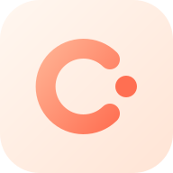

<p align="center">
  
</p>

<h1 align="center">Claude Everywhere</h1>

<p align="center">
  <strong>Supervise your AI coder from anywhere.</strong><br>
  Watch and steer the Claude Code on your computer — from your phone, over your own private network.
</p>

<p align="center">
  <a href="https://github.com/lqzzy/claude-everywhere/releases"></a>
  
  
  <a href="./LICENSE"></a>
</p>

---

You start a task on your computer, then walk away. On your phone you watch Claude Code think, run tools, and write code in real time — and when it drifts, you send one message to put it back on track. No laptop required.

<details>
<summary><strong>Contents</strong></summary>

- [Why](#why)
- [Features](#features)
- [How it works](#how-it-works)
- [Get started](#get-started)
  - [Prerequisites](#prerequisites)
  - [Set up Tailscale](#set-up-tailscale)
  - [Run it](#run-it)
  - [Get the app](#get-the-app)
- [Configuration](#configuration)
- [Security](#security)
- [Permissions](#permissions)
- [Roadmap](#roadmap)
- [Contributing](#contributing)
- [License](#license)

</details>

## Why

**The programmer's job is changing.** As Claude Code gets better, more of the work becomes *describing* what you want and *reviewing* what comes back — and increasingly you don't touch the code at all. You point; it builds. The job becomes supervision: keep it aimed the right way, catch it when it wanders, approve it when it's right.

But supervision is still trapped at your desk. The agent runs in a terminal **on your computer**, so "keeping an eye on it" means sitting in front of that terminal. A twenty-minute refactor becomes twenty minutes in your chair watching logs scroll.

It doesn't have to be. **Watching isn't typing** — it needs a glance, not a keyboard. Claude Everywhere puts that glance on your phone: kick off a task, pocket your phone, and follow along from the couch, the train, or the lunch line. See exactly what it's doing, nudge it when it drifts, and let it run when it's on track. The desk becomes optional.

## Features

- 📺 **Live view** — streaming replies, the current tool it's running, a token heartbeat, and a context-usage gauge, all in real time.
- 💬 **Steer with a message** — reply, redirect, or interrupt a turn from your phone.
- 🤝 **Seamless hand-off** — a session you start on your phone continues in your terminal with `claude --resume`, and vice-versa. Both sides read the same on-disk transcript, so it never forks.
- 🔄 **Always fresh** — the app auto-refreshes on reconnect and when you reopen it; the server watches the transcript so terminal/background activity shows up without a manual refresh.
- 🔒 **Private by design** — the relay runs on your own machine and traffic rides your [Tailscale](https://tailscale.com) network (encrypted). No third-party cloud, just one bearer token.
- ⚡ **One command + a scan** — `./install.sh` on the computer prints a QR code; scan it and the app is connected.
- 🎨 **Native app** — Kotlin + Jetpack Compose, a calm "liquid glass" UI. minSdk Android 12.

## How it works

```
Phone app  ──WebSocket──>  relay service (Node/TS, Agent SDK)  ──resume per turn──>  claude
 (Kotlin/Compose)          stateless: source of truth is ~/.claude/projects/*.jsonl
                                      │
                          terminal `claude --resume <id>` continues the same session, no fork
```

- **server/** — the relay. Each message is a one-shot `query()` ([`@anthropic-ai/claude-agent-sdk`](https://www.npmjs.com/package/@anthropic-ai/claude-agent-sdk)) that runs to completion and exits; session state lives on disk as the standard transcript, not in memory. It maps the SDK event stream to a compact WebSocket protocol and `fs.watch`-es the open session so terminal hand-offs and background turns reach the phone in near real time.
- **kotlin-app/** — the phone app. OkHttp WebSocket (events backed by a `Channel`, never dropped), conversation rendered from structured content blocks, and auto-refresh on foreground/reconnect.

## Get started

### Prerequisites

- **Node ≥ 20** on the computer.
- **[Claude Code](https://claude.com/claude-code)** installed and signed in on the computer (the relay drives it via the Agent SDK).
- **[Tailscale](https://tailscale.com)** on both the computer and the phone — how the phone reaches your computer from any network. Free for personal use. Setup below.

> Without Tailscale it still works, but only when the phone and computer are on the **same Wi-Fi** (the installer falls back to your LAN IP).

### Set up Tailscale

Tailscale puts your computer and phone on one private, encrypted network — each device gets a stable `100.x.y.z` address and the phone can reach the computer from anywhere, without exposing any port to the public internet.

**Computer — macOS**

```bash
brew install --cask tailscale     # or get "Tailscale" from the Mac App Store
```

Open the Tailscale app and sign in.

> `install.sh` auto-detects the app's bundled CLI at `/Applications/Tailscale.app/Contents/MacOS/Tailscale`. To call `tailscale` from your shell, symlink it once:
>
> ```bash
> sudo ln -sf /Applications/Tailscale.app/Contents/MacOS/Tailscale /usr/local/bin/tailscale
> ```

**Computer — Linux**
```bash
curl -fsSL https://tailscale.com/install.sh | sh
sudo tailscale up                 # opens a login URL — sign in
```

**Phone — Android**
1. Install **Tailscale** from Google Play.
2. Sign in with the **same account** as the computer.
3. Toggle the VPN **on**.

Verify the phone shows up:

```bash
tailscale status     # your phone should appear in the device list
```

### Run it

```bash
git clone https://github.com/lqzzy/claude-everywhere
cd claude-everywhere
./install.sh
```

`install.sh` checks prerequisites, installs dependencies, generates an `AUTH_TOKEN` on first run (saved to `server/.env`), detects your Tailscale/LAN IP, **prints a QR code**, and starts the relay on `ws://0.0.0.0:4000`. Keep this terminal running.

### Get the app

**Easiest — download the APK:** grab the latest `claude-everywhere-*.apk` from [**Releases**](https://github.com/lqzzy/claude-everywhere/releases) and install it (allow "install from unknown sources"). Android 12+.

**Or build from source:**
```bash
cd kotlin-app
./gradlew installDebug     # or open in Android Studio and run
```

On first launch the app shows a **Connect** screen — **scan the QR code in your terminal** and it fills in the address and token and connects. (You can also enter them by hand.) It remembers the connection, so next time it just connects.

## Configuration

`server/.env` (created by `install.sh`; see `server/.env.example`):

| Key | Description |
|---|---|
| `AUTH_TOKEN` | Required; the phone sends it to connect. Generated automatically on first run. |
| `DEFAULT_CWD` | Default working directory for sessions started from the app (defaults to your home). |
| `CONTEXT_LIMIT` | Denominator for the Context% gauge; `1000000` for Opus 1M context, default 200000 (corrected at runtime from the model's real window). |
| `PORT` / `HOST` | Listen port/address, default `4000` / `0.0.0.0`. |

## Security

Traffic runs over Tailscale, which is already end-to-end encrypted (WireGuard), so the relay speaks plain `ws://` inside that private tunnel and authenticates with a single bearer `AUTH_TOKEN`. **Don't expose port 4000 to the public internet** — keep it on your tailnet (or LAN). The token lives in `server/.env`, which is git-ignored; rotate it by deleting the `AUTH_TOKEN` line and re-running `./install.sh` (then re-scan on the phone).

## Permissions

The app defaults to `permissionMode: "bypassPermissions"` — it's you, controlling your own computer, so tools run without prompting. The protocol reserves a `permission.request` / `permission.respond` channel; switch to `default` mode + `canUseTool` if you'd rather approve dangerous operations from the phone.

## Roadmap

- [x] Prebuilt APK on Releases
- [ ] Push notifications when a turn finishes or needs you
- [ ] On-device approval prompts for dangerous operations (opt-in)
- [ ] Pin / multi-select sessions, persisted
- [ ] 5h / 7d usage-quota bars
- [ ] Run the relay as a background service (launchd / systemd)
- [ ] iOS app

## Contributing

Issues and PRs welcome. The repo is two parts — `server/` (Node/TS, `npm run dev`) and `kotlin-app/` (Android Studio / `./gradlew`). Keep comments and UI text in English.

## License

[MIT](./LICENSE)
